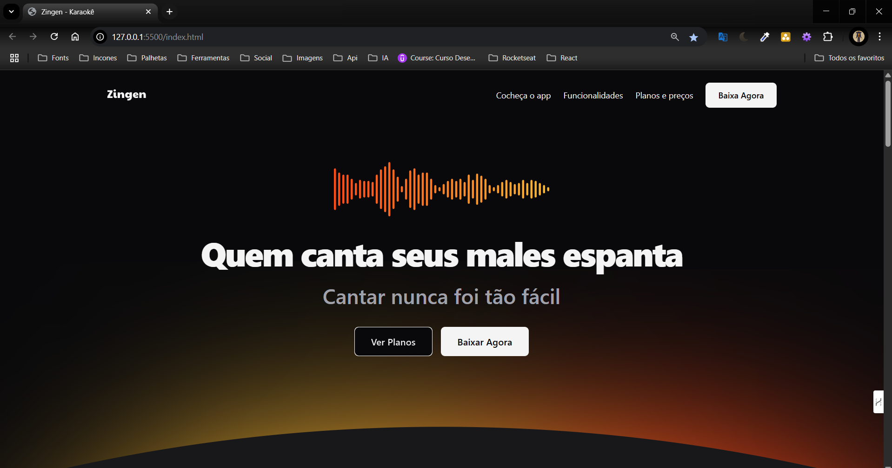

  

<h1 align="center">🎤 Zingen - Karaokê</h1>

  Uma landing page moderna e responsiva para um aplicativo de Karaokê com inteligência artificial.

---

## 🔧 Tecnologias utilizadas

- [HTML5](https://developer.mozilla.org/pt-BR/docs/Web/HTML)
- [CSS3](https://developer.mozilla.org/pt-BR/docs/Web/CSS)
- [Google Fonts - Inter](https://fonts.google.com/specimen/Inter)
- [Git](https://git-scm.com/)
- [GitHub](https://github.com/)
- [Visual Studio Code](https://code.visualstudio.com/)
- [Figma](https://www.figma.com/)
- [Responsively App](https://responsively.app/)

## 🎯 O que aprendi com esse projeto

- Estruturar seções semânticas com HTML e aplicar boas práticas de acessibilidade
- Desenvolver layouts modernos e organizados com CSS
- Utilizar variáveis CSS, Grid Layout e design mobile-first
- Trabalhar responsividade com testes em diferentes dispositivos usando o Responsively App
- Integrar fontes externas para compor uma identidade visual consistente
- Praticar o uso de Git e GitHub para controle de versão e colaboração
- Utilizar Figma para estruturação visual e referência de layout
- Editar e testar código de forma eficiente com o VS Code

## 🌐 Repositório no GitHub

🔗 [github.com/IsraellSan7os/Zingen](https://github.com/IsraellSan7os/Zingen)

---

Agradeço à comunidade da **Rocketseat** e às ferramentas como o **Responsively App**, que têm sido fundamentais na minha jornada de aprendizado em desenvolvimento web! 💙🎶

## 📌 Tags

`#HTML` `#CSS` `#WebDesign` `#LandingPage` `#Responsividade` `#ResponsivelyApp` `#ZingenKaraoke` `#DesenvolvimentoWeb` `#ProjetosPessoais` `#Git` `#GitHub` `#VSCode` `#Figma`
